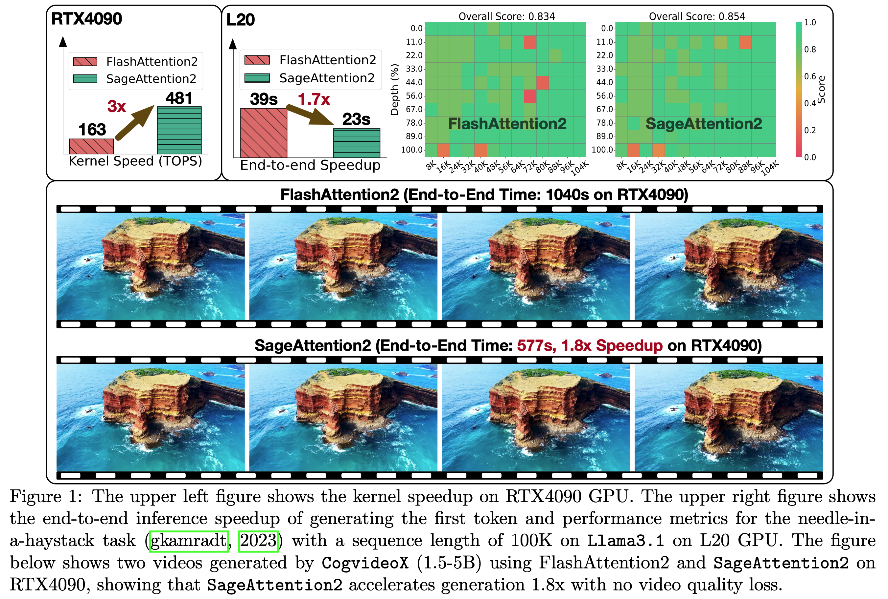
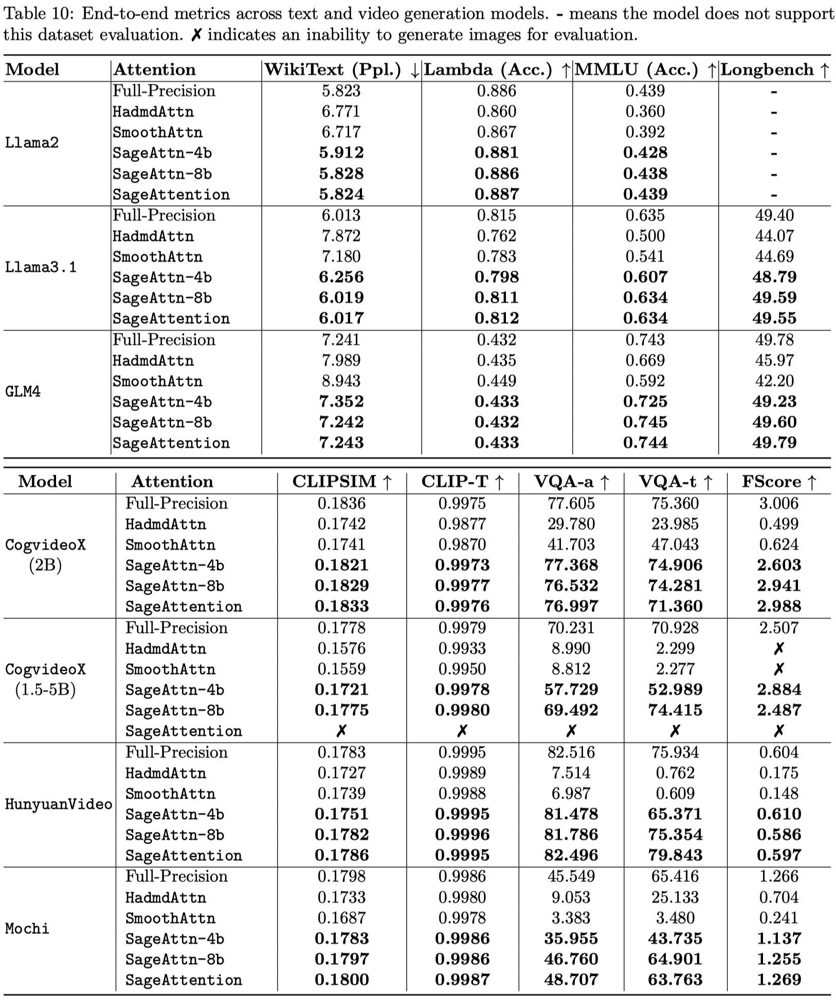
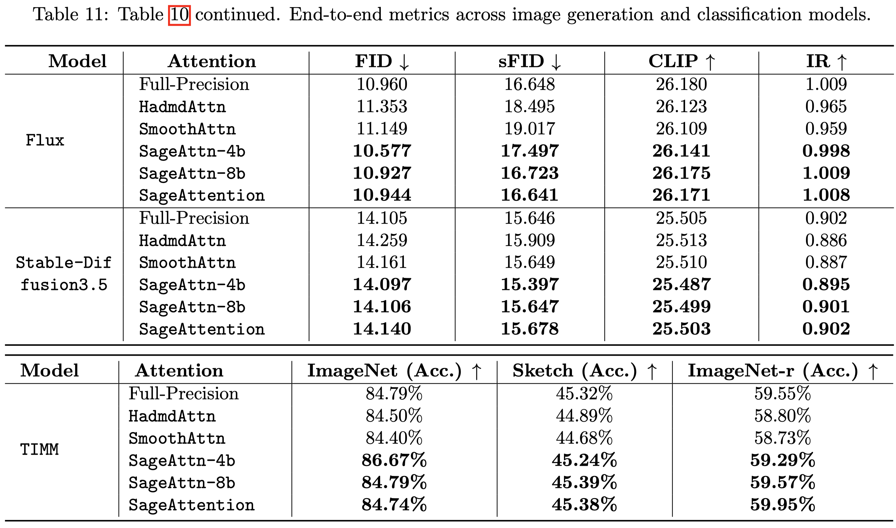

# SageAttention
We are continuously updating more features. You could **Star** and **Watch** our repository to stay updated.

---
This repository provides the official implementation of SageAttention and SageAttention2.

**SageAttention: Accurate 8-Bit Attention for Plug-and-play Inference Acceleration**  
Paper: https://arxiv.org/abs/2410.02367  
Jintao Zhang, Jia Wei, Haofeng Huang, Pengle Zhang, Jun Zhu, Jianfei Chen

**SageAttention2: Efficient Attention with Thorough Outlier Smoothing and Per-thread INT4 Quantization**  
Paper: https://arxiv.org/abs/2411.10958  
Jintao Zhang, Haofeng Huang, Pengle Zhang, Jia Wei, Jun Zhu, Jianfei Chen



## Beta Version of SageAttention2
This is a beta release of SageAttention2. We welcome any feedback on accuracy, performance issues, bugs, feature requests, or suggestions. Please feel free to open an issue or launch a pull request!

Current Features:
+ INT8 quantization for $QK^\top$ with support for varying granularities
+ FP8 quantization for $PV$
+ FP32 buffer for $PV$ to improve accuracy in FP8 MMA
+ Support `torch.compile` with non-cudagraphs mode and distributed inference

For a stable version, please use the branch of [SageAttention-1](https://github.com/thu-ml/SageAttention/tree/sageattention-1) branch.

## Project Updates
- **News** [2024-12-20]: Update the [SageAttention2 Paper](https://arxiv.org/abs/2411.10958).
- **News** [2024-12-20]: We are excited to announce the release of SageAttention 2.0.1 Beta! In this version, we introduce a new feature: per-thread quantization, which offers finer granularity while maintaining hardware efficiency.
- **News** [2024-11-21]: SageAttention 2.0.0 beta is released! Now SageAttention has measured speedup on L20, L40, A100, A800, and A6000 other than RTX3090 and RTX4090.
- **News** [2024-11-12]: Support for `sageattn_varlen` is available now.
- **News** [2024-11-11]: Support for different sequence lengths between `q` and `k,v`,  `(batch_size, head_num, seq_len, head_dim)` or `(batch_size, seq_len, head_num, head_dim)` input shapes, and `group-query attention` is available now.


## Base environment
+ `python>=3.9`   
+ `torch>=2.3.0`  
+ `triton>=3.0.0` 
+ `CUDA>=12.4` if you want to use fp8 else `CUDA>=12.0`
+ `flash-attn` for benchmarking

## Installation

For the stable version or Triton-only version, refer to [SageAttention-1](https://github.com/thu-ml/SageAttention/tree/sageattention-1) and install using pip:
```
pip install sageattention==1.0.6
```

To use SageAttention 2.0.1, please **compile from source**:
```
git clone https://github.com/thu-ml/SageAttention.git
cd sageattention 
python setup.py install  # or pip install -e .
```


> **Note:** Currently, SageAttention is optimized for excellent performance on RTX4090, RTX3090, L20, and L40 GPUs. On A100, A800, and A6000 GPUs, performance is best with a `head_dim=128`, while `head_dim=64` is less optimal. Similarly, performance on the Hopper architecture is currently not optimal. We are actively working to enhance performance in these configurations.


## How to Use
```python
from sageattention import sageattn
attn_output = sageattn(q, k, v, tensor_layout="HND", is_causal=False)
```
+ `q, k, v` are **FP16/BF16** dtype with the shape `(batch_size, head_num, seq_len, head_dim)` using default `tensor_layout="HND"`. For shape `(batch_size, seq_len, head_num, head_dim)`, set `tensor_layout="NHD"`. 
+ `is_causal` determines the use of a causal mask.

### Available APIs:
+ `sageattn`: Automatically selects the optimal kernel based on the GPU to achieve a good performance-accuracy trade-off.
+ `sageattn_qk_int8_pv_fp16_triton`: INT8 quantization for $QK^\top$ and FP16 for $PV$ using Triton backend.
+ `sageattn_qk_int8_pv_fp16_cuda`: INT8 quantization for $QK^\top$ and FP16 for $PV$ using CUDA backend.
+ `sageattn_qk_int8_pv_fp8_cuda`: INT8 quantization for $QK^\top$ and FP8 for $PV$ using CUDA backend.
+ `sageattn_varlen`: INT8 quantization for $QK^\top$ and FP16 for $PV$ using Triton backend. Support for varying sequence lengths within the same batch.

For optimal speed and accuracy performance on custom devices and models, we strongly recommend referring to the [this file](./sageattention/core.py) for detailed guidance.

> **Note:**
Support for different sequence lengths between `q` and `k,v` and `group-query attention` is available.


## **Plug-and-play Example**

We can replace `scaled_dot_product_attention` easily. 
We will take [CogvideoX](https://huggingface.co/THUDM/CogVideoX-2b) as an example:

Add the following codes and run
```python
from sageattention import sageattn
import torch.nn.functional as F

F.scaled_dot_product_attention = sageattn
```

Specifically,

```bash
cd example
python sageattn_cogvideo.py --compile
```

**You can get a lossless video in** `./example` **faster than by using** `python original_cogvideo.py --compile`

> **Note:** Not all models works with `F.scaled_dot_product_attention = sageattn`. Technically, you should replace the original Attention by modifying the `Attention Class` of the target model. For image and video models, we suggest only replacing the attention in DiT.


## Performance
### Speed of Kernels

`8+8` means the kernel with INT8 quantization for $QK^\top$ and FP8 quantization for $PV$. `8+16` uses FP16 with FP16 accumulator for $PV$.


> **Note:** The TOPS results refer only to the Attention Kernel, excluding the quantization and smoothing.


### End-to-end Performance
#### **End-to-End Accuracy:**






#### **End-to-End Speedup:**


## Citation
**If you use this code or find our work valuable, please cite:**
```
@inproceedings{zhang2025sageattention,
      title={SageAttention: Accurate 8-Bit Attention for Plug-and-play Inference Acceleration}, 
      author={Zhang, Jintao and Wei, Jia and Zhang, Pengle and Zhu, Jun and Chen, Jianfei},
      booktitle={International Conference on Learning Representations (ICLR)},
      year={2025}
}

@misc{zhang2024sageattention2,
      title={SageAttention2: Efficient Attention with Thorough Outlier Smoothing and Per-thread INT4 Quantization}, 
      author={Jintao Zhang and Haofeng Huang and Pengle Zhang and Jia Wei and Jun Zhu and Jianfei Chen},
      year={2024},
      eprint={2411.10958},
      archivePrefix={arXiv},
      primaryClass={cs.LG},
      url={https://arxiv.org/abs/2411.10958}, 
}
```
