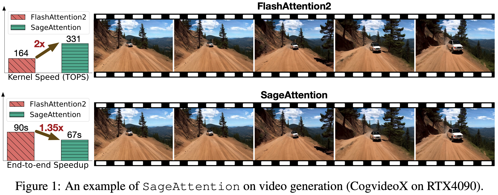
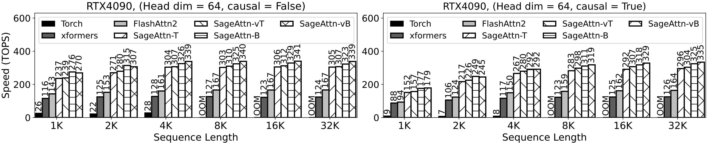

# SageAttention

This repository provides the official implementation of SageAttention.

**SageAttention: Accurate 8-Bit Attention for Plug-and-play Inference Acceleration**  
Paper: https://arxiv.org/abs/2410.02367  
Jintao Zhang, Jia Wei, Haofeng Huang, Pengle Zhang, Jun Zhu, Jianfei Chen

**SageAttention2 Technical Report: Accurate 4-Bit Attention for Plug-and-play Inference Acceleration**  
Paper: https://arxiv.org/abs/2411.10958  
Jintao Zhang, Haofeng Huang, Pengle Zhang, Jia Wei, Jun Zhu, Jianfei Chen


*SageAttention*


*SageAttention2*

## Project Updates
- **News** 2024-11-19: SageAttention2 will be released soon.
- **News** 2024-11-12: Support for `sageattn_varlen` is available now.
- **News** 2024-11-11: Support for different sequence length between `q` and `k,v`,  `(batch_size, head_num, seq_len, head_dim)` or `(batch_size, seq_len, head_num, head_dim)` input shapes, and `group-query attention` is available now.


## Base environment
`python>=3.9`   
`torch>=2.3.0`  
`triton>=2.3.0` 

We recommend to install: (the kernel will be faster a little)  
`python>=3.11`  
`torch>=2.4.0`  
`triton-nightly`


## Installation
Install using pip:  
```
pip install sageattention
```

Or compiling from source:
```
cd sageattention 
pip install .
```


> **Note:** SageAttention is currently optimized for RTX4090 and RTX3090 GPUs. Performance improvements may not be significant on other GPU architectures. We will progressively extend support to other GPUs.


## How to use
```python
from sageattention import sageattn
attn_output = sageattn(q, k, v, tensor_layout="HND", is_causal=False, smooth_k=True)
```
`q, k, v` are **FP16/BF16/FP32** type with the shape `(batch_size, head_num, seq_len, head_dim)` using default `tensor_layout="HND"`. For shape `(batch_size, seq_len, head_num, head_dim)`, set `tensor_layout="NHD"`. `is_causal` determines the use of a causal mask. `smooth_k` is a technique we proposed to ensure the accuracy. Disabling `smooth_k` might slightly increase speed, but could compromise accuracy if the distribution of `q, k, v` is irregular. In rare cases, setting `smooth_k` to `False` may result in better accuracy.

> **Note:** `sageattn` is an accurate implementation that integrating smoothing K, INT8 per-block quantization for `q, k`, and a FP16 accumulator for Matmul of $PV$. 
Support for `head_dim` values of `64`, `96`, and `128` is currently available. Extended support for values 48, 72, and 256 will be available soon.
Support for different sequence length between `q` and `k,v` and `group-query attention` is available.
Support of different sequences length in the same batch is available through `sageattn_varlen`.


## **Plug-and-play Example**

**We can replace `scaled_dot_product_attention` easily.**  
We will take [Cogvideo](https://huggingface.co/THUDM/CogVideoX-2b) as an example:

**Just add the following codes and run!**
```python
from sageattention import sageattn
import torch.nn.functional as F

F.scaled_dot_product_attention = sageattn
```

Specifically,

```bash
cd example
python sageattn_cogvideo.py
```

**You can get a lossless video in** `./example` **faster than by using** `python original_cogvideo.py`

> **Note:** Not all models use `F.scaled_dot_product_attention`, so maybe you should replace the original Attention by modifying the `Attention Class` of the target model (as shown in another example in `./example`).


## Performance
### Speed of Kernels



> **Note:** The TOPS results refer only to the Attention Kernel, excluding the quantization and smoothing K.

### End-to-end performance


## Citation
If you use this code or find our work valuable, please cite:
```
@misc{zhang2024sageattention,
      title={SageAttention: Accurate 8-Bit Attention for Plug-and-play Inference Acceleration}, 
      author={Jintao Zhang and Jia wei and Haofeng Huang and Pengle Zhang and Jun Zhu and Jianfei Chen},
      year={2024},
      eprint={2410.02367},
      archivePrefix={arXiv},
      primaryClass={cs.LG},
      url={https://arxiv.org/abs/2410.02367}, 
}

@misc{zhang2024sageattention2,
      title={SageAttention2 Technical Report: Accurate 4 Bit Attention for Plug-and-play Inference Acceleration}, 
      author={Jintao Zhang and Haofeng Huang and Pengle Zhang and Jia Wei and Jun Zhu and Jianfei Chen},
      year={2024},
      eprint={2411.10958},
      archivePrefix={arXiv},
      primaryClass={cs.LG},
      url={https://arxiv.org/abs/2411.10958}, 
}
```
