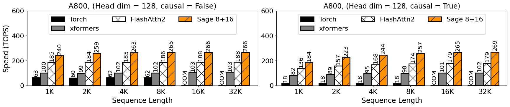
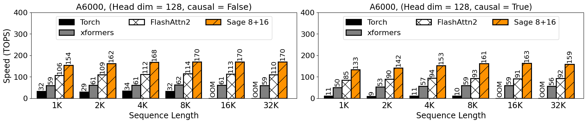
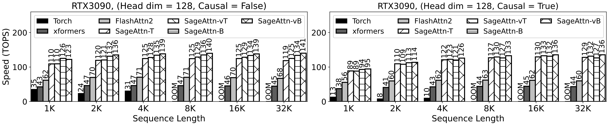

# SageAttention

This repository provides the official implementation of SageAttention.

**SageAttention: Accurate 8-Bit Attention for Plug-and-play Inference Acceleration**  
Paper: https://arxiv.org/abs/2410.02367  
Jintao Zhang, Jia Wei, Haofeng Huang, Pengle Zhang, Jun Zhu, Jianfei Chen

**SageAttention2 Technical Report: Accurate 4-Bit Attention for Plug-and-play Inference Acceleration**  
Paper: https://arxiv.org/abs/2411.10958  
Jintao Zhang, Haofeng Huang, Pengle Zhang, Jia Wei, Jun Zhu, Jianfei Chen


*SageAttention*


*SageAttention2*

## Beta Version
This is a beta release of SageAttention 2. We welcome any feedback on accuracy, performance issues, bugs, feature requests, or suggestions for improvements. Please feel free to open an issue or submit a pull request!

Features:
+ INT8 quantization for `q, k`
+ FP8 quantization for `PV`
+ FP32 buffer for `PV` accumulator to increase accuracy of low-precision accumulator. 

For stable version, refer to [SageAttention 1](https://github.com/thu-ml/SageAttention/tree/sageattention-1)

## Project Updates
- **News** 2024-11-21: SageAttention 2.0.0 beta is released! Now SageAttention has measured speedup on L20, L40, A100, A800 and A6000 other than RTX3090 and RTX4090.
- **News** 2024-11-19: SageAttention2 will be released soon.
- **News** 2024-11-12: Support for `sageattn_varlen` is available now.
- **News** 2024-11-11: Support for different sequence length between `q` and `k,v`,  `(batch_size, head_num, seq_len, head_dim)` or `(batch_size, seq_len, head_num, head_dim)` input shapes, and `group-query attention` is available now.


## Base environment
+ `python>=3.9`   
+ `torch>=2.3.0`  
+ `triton>=3.0.0` 
+ `CUDA>=12.4` if you want to use fp8 else `CUDA>=12.0`

We recommend to install: (the kernel will be faster a little)  
+ `python>=3.11`  
+ `torch>=2.4.0`  
+ `triton-nightly`
+ `CUDA=12.6`


## Installation

For stable version or python only version, refer to [SageAttention 1](https://github.com/thu-ml/SageAttention/tree/sageattention-1) or install using pip:
```
pip install sageattention==1.0.6
```

To use SageAttention 2.0.0, compile from source:
```
git clone https://github.com/thu-ml/SageAttention.git
cd sageattention 
pip install -e . # or python setup.py install
```


> **Note:** SageAttention is currently optimized for RTX4090, RTX3090, L20, and L40 GPUs, where performance is excellent. For A100, A800, and A6000 GPUs, the performance is best with `head_dim=128`. However, `head_dim=64` on A100, A800, and A6000 GPUs, as well as performance on the Hopper architecture, are currently suboptimal. We are actively working on improving performance for these settings.


## How to use
```python
from sageattention import sageattn
attn_output = sageattn(q, k, v, tensor_layout="HND", is_causal=False)
```
+ `q, k, v` are **FP16/BF16** type with the shape `(batch_size, head_num, seq_len, head_dim)` using default `tensor_layout="HND"`. For shape `(batch_size, seq_len, head_num, head_dim)`, set `tensor_layout="NHD"`. 
+ `is_causal` determines the use of a causal mask.

### Available APIs:
+ `sageattn`: Automacially selects the kernel based on GPU compute capability that achieves good performance-accuracy trade-off.
+ `sageattn_qk_int8_pv_fp16_triton`: Uses INT8 quantization for `q, k` and FP16 for `PV` with FP16 accumulator and Triton backend.
+ `sageattn_qk_int8_pv_fp16_cuda`: use INT8 quantization for `q, k` and FP16 for `PV` with CUDA backend.
+ `sageattn_qk_int8_pv_fp8_cuda`: Uses INT8 quantization for `q, k` and FP8 for `PV` with CUDA backend.
+ `sageattn_varlen`: Supports different sequences length in the same batch, using INT8 quantization for `q, k` and FP16 for `PV` with FP16 accumulator and Triton backend.

For optimal performance while maintaining accuracy on custom devices and models, we strongly recommend referring to the [this file](./sageattention/core.py) for detailed guidance.

> **Note:**
Support for `head_dim` values of `64`, `96`, and `128` is currently available. Extended support for other `head_dim` is under development.
Support for different sequence length between `q` and `k,v` and `group-query attention` is available.


## **Plug-and-play Example**

**We can replace `scaled_dot_product_attention` easily.**  
We will take [Cogvideo](https://huggingface.co/THUDM/CogVideoX-2b) as an example:

**Just add the following codes and run!**
```python
from sageattention import sageattn
import torch.nn.functional as F

F.scaled_dot_product_attention = sageattn
```

Specifically,

```bash
cd example
python sageattn_cogvideo.py
```

**You can get a lossless video in** `./example` **faster than by using** `python original_cogvideo.py`

> **Note:** Not all models use `F.scaled_dot_product_attention`, so maybe you should replace the original Attention by modifying the `Attention Class` of the target model (as shown in another example in `./example`).


## Performance
### Speed of Kernels











> **Note:** The TOPS results refer only to the Attention Kernel, excluding the quantization and smoothing. For FP16 `PV`, we use FP16  accumulator and for FP8 `PV` we use FP32 accumulator.

### End-to-end performance


## Citation
If you use this code or find our work valuable, please cite:
```
@misc{zhang2024sageattention,
      title={SageAttention: Accurate 8-Bit Attention for Plug-and-play Inference Acceleration}, 
      author={Jintao Zhang and Jia wei and Haofeng Huang and Pengle Zhang and Jun Zhu and Jianfei Chen},
      year={2024},
      eprint={2410.02367},
      archivePrefix={arXiv},
      primaryClass={cs.LG},
      url={https://arxiv.org/abs/2410.02367}, 
}

@misc{zhang2024sageattention2,
      title={SageAttention2 Technical Report: Accurate 4 Bit Attention for Plug-and-play Inference Acceleration}, 
      author={Jintao Zhang and Haofeng Huang and Pengle Zhang and Jia Wei and Jun Zhu and Jianfei Chen},
      year={2024},
      eprint={2411.10958},
      archivePrefix={arXiv},
      primaryClass={cs.LG},
      url={https://arxiv.org/abs/2411.10958}, 
}
```
