# Kernel Benchmarking

Here we provide script to benchmark the speed of different kernels including SageAttention, FlashAttention2 and FlashAttention3. Please ensure that the `flash-attn` package is installed, as we use its benchmark API for performance evaluation.

## Install FlashAttention3

To benchmark FlashAttention3 and its FP8 variant, make sure you follow the installation guide below since the interface of FlashAttention3 is not stable yet.

```bash
git clone https://github.com/Dao-AILab/flash-attention.git --recursive
git checkout b7d29fb3b79f0b78b1c369a52aaa6628dabfb0d7 # 2.7.2 release
cd hopper
python setup.py install
```

## Available Arguments
Some kernels support passing the following arguments:
+ `--quant_gran`: Quantization granularity for $Q$ and $K$.
+ `--pv_accum_dtype`: Accumulation data type for $PV$. Those with `+` corresponds to the two-level accumulation strategy. **`fp32+fp16` means SageAttention2++.**

Example usage:
```bash
# on RTX 4090
python bench_qk_int8_pv_fp8_cuda.py --pv_accum_dtype fp32+fp16 --quant_gran per_warp

# on H100
python bench_qk_int8_pv_fp8_cuda_sm90.py --pv_accum_dtype fp32+fp32 --quant_gran per_thread
```

## Benchmarking Results
We provide the benchmarking results on RTX4090, L20, A100, A800, A6000, RTX3090, H20 and H100 GPUs.

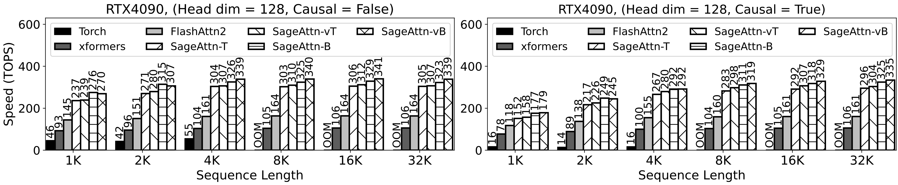


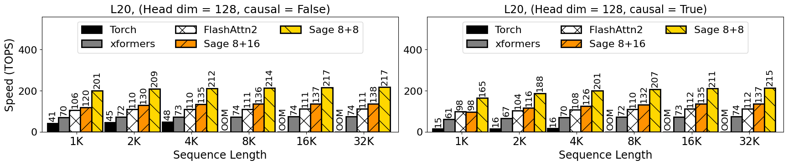

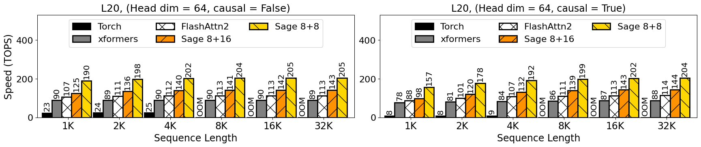

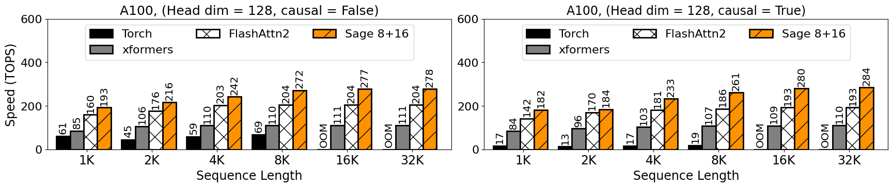


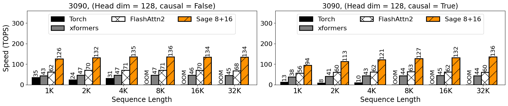

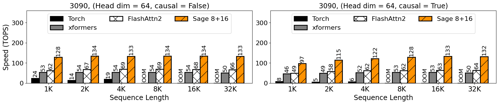

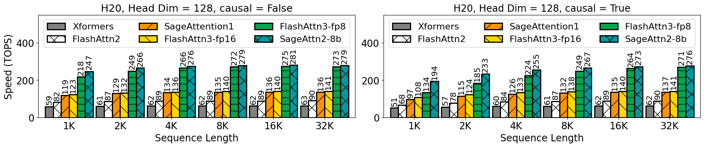

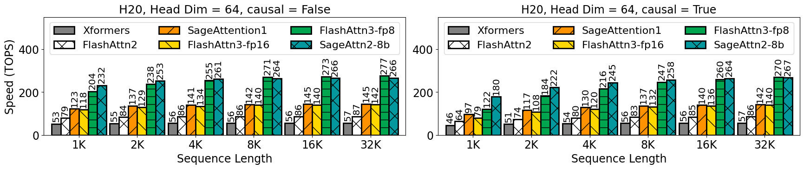

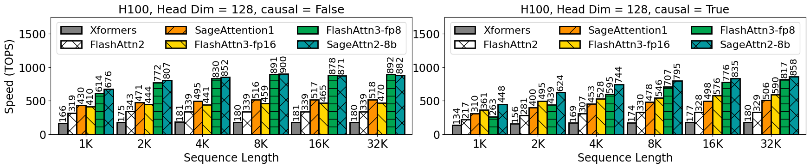
 


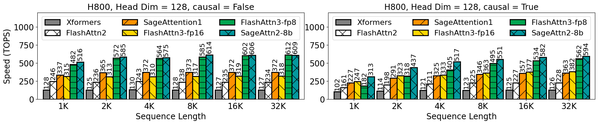
 
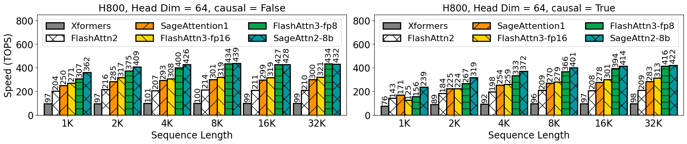
 
> **Note:** The TOPS results refer only to the Attention Kernel, excluding the quantization and smoothing.