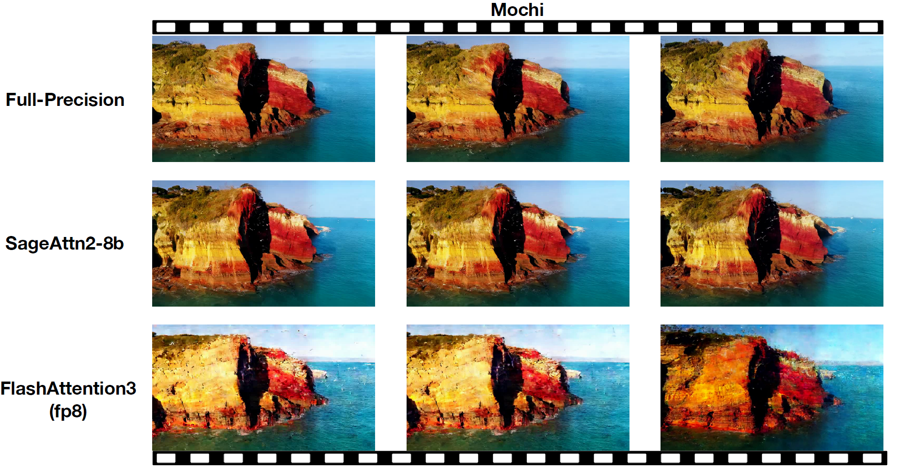
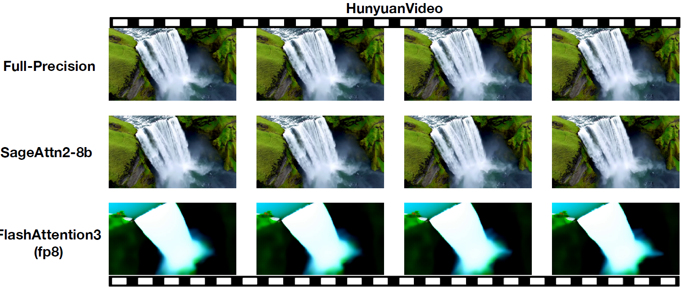

## Plug-and-play Example

This folder contains **plug-and-play inference scripts** for five Diffusers video models replacing SDPA with **sageattn**.

Supported models:

* **CogVideoX:** [CogVideoX-2B](https://huggingface.co/zai-org/CogVideoX-2b) and [CogVideoX1.5-5B](https://huggingface.co/zai-org/CogVideoX1.5-5B)
* **WAN:** [Wan2.1-T2V-1.3B](https://huggingface.co/Wan-AI/Wan2.1-T2V-1.3B-Diffusers), [Wan2.1-T2V-14B](https://huggingface.co/Wan-AI/Wan2.1-T2V-14B-Diffusers) and [Wan2.2-T2V-A14B](https://huggingface.co/Wan-AI/Wan2.2-T2V-A14B-Diffusers)
* [**HunyuanVideo**](https://huggingface.co/tencent/HunyuanVideo-1.5): SageAttention is officially supported in the inference code via CLI flags (`--use_sageattn` and `--sage_blocks_range`). Please refer to this Hugging Face model card for the implementation guide.
* [**Mochi**](https://huggingface.co/genmo/mochi-1-preview)
* **LTX-Video:** [0.9.7-dev](https://huggingface.co/Lightricks/LTX-Video-0.9.7-dev) and [spatial upscaler](https://huggingface.co/Lightricks/ltxv-spatial-upscaler-0.9.7)

**We can replace `scaled_dot_product_attention` easily.**  
We will take [CogvideoX](https://huggingface.co/zai-org/CogVideoX-2b) as an example:

**Just add the following codes and run!**
```python
from sageattention import sageattn
import torch.nn.functional as F

F.scaled_dot_product_attention = sageattn
```

Specifically,

```bash
cd example
python cogvideox_infer.py --model cogvideox-2b --compile --attention_type sage
```

**You can get a lossless video in** `./example/videos/<model>/<attention_type>/` **faster than by using** `--attention_type sdpa`.

> **Note:** If you set `--compile`, the first run will be slower than the following runs. Please run it twice to get the accurate speed.

> **Note:** `torch.compile` is generally incompatible with `enable_sequential_cpu_offload()`. Don't use them together.

## Modify Attention From Source Code
To have finer control over where to use SageAttention, you can modify a small subset of the source code. For example, in [`modify_mochi.py`](./modify_model/modify_mochi.py), you can replace the `MochiAttnProcessor2_0` from diffusers with your own attention class.

> **Note:** In Diffusers pipelines, HunyuanVideo uses `attention_mask` which is not supported by the `sageattn` API. As a workaround, you can follow [SageAttention Issue #115](https://github.com/thu-ml/SageAttention/issues/115) to modify the official attention implementation from the [HunyuanVideo repo](https://github.com/Tencent-Hunyuan/HunyuanVideo-1.5/blob/main/hyvideo/models/transformers/modules/attention.py) to **split text tokens vs image tokens**, then apply SageAttention only to the large **image-token self-attention** (mask-free), while keeping the masked/text part on SDPA/FlashAttention.





## Parallel SageAttention Inference

Install xDiT(xfuser >= 0.3.5) and diffusers(>=0.32.0.dev0) from sources and run:

```bash
# install latest xDiT(xfuser).
pip install "xfuser[flash_attn]"
# install latest diffusers (>=0.32.0.dev0), need by latest xDiT.
git clone https://github.com/huggingface/diffusers.git
cd diffusers && python3 setup.py bdist_wheel && cd dist && python3 -m pip install *.whl
# then run parallel sage attention inference.
./run_parallel.sh
```


