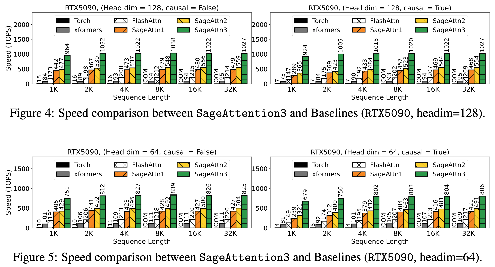
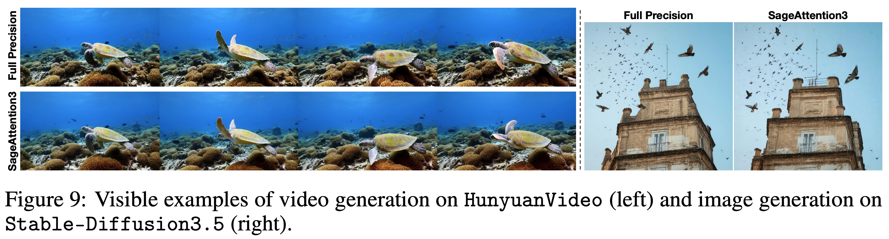

# SageAttention3
<!-- We are continuously updating more features. You could **Star** and **Watch** our repository to stay updated.

--- -->
This repository provides the official implementation of SageAttention3

**SageAttention3: Microscaling FP4 Attention for Inference and An Exploration of 8-Bit Training**  
Paper: https://arxiv.org/abs/2505.11594  
Jintao Zhang, Jia Wei, Pengle Zhang, Xiaoming Xu, Haofeng Huang, Haoxu Wang, Kai Jiang, Jun Zhu, Jianfei Chen

# Limitaitions:
Currently, SageAttention3 works well for: 
1. Video generation models: CogVideoX-2B, HunyuanVideo, Mochi.
2. Almost all image generation models, including Flux and Stable-Diffusion3.5.

**Note: SageAttention3 does not guarantee lossless acceleration for all models. For other video generation models, we recommend selectively using SageAttention2++ in certain layers or timesteps.**  

For example:  
- Apply **SageAttention2++** only at the **first and last timesteps**,  
- Use **SageAttention3** for all the others.  

This hybrid approach may achieve **lossless acceleration**.  

## Installation
### Base environment
+ `python>=3.13`   , `torch>=2.8.0`, `CUDA >=12.8`

### Install Package

To use SageAttention3, please **compile from source**:
```
git clone https://github.com/thu-ml/SageAttention
cd SageAttention/sageattention3_blackwell 
python setup.py install
```


## How to Use
```python
from sageattn3 import sageattn3_blackwell
attn_output = sageattn3_blackwell(q, k, v, is_causal=False)
```
+ `q, k, v` are **FP16/BF16** dtype with the shape `(batch_size, head_num, seq_len, head_dim)` 
+ `is_causal` determines the use of a causal mask.

## Performance
### Speed of Kernels


### Video and Image Generation Examples



## Citation
**If you use this code or find our work valuable, please cite:**
```
@inproceedings{zhang2025sageattention,
  title={SageAttention: Accurate 8-Bit Attention for Plug-and-play Inference Acceleration}, 
  author={Zhang, Jintao and Wei, Jia and Zhang, Pengle and Zhu, Jun and Chen, Jianfei},
  booktitle={International Conference on Learning Representations (ICLR)},
  year={2025}
}
@inproceedings{zhang2024sageattention2,
  title={Sageattention2: Efficient attention with thorough outlier smoothing and per-thread int4 quantization},
  author={Zhang, Jintao and Huang, Haofeng and Zhang, Pengle and Wei, Jia and Zhu, Jun and Chen, Jianfei},
  booktitle={International Conference on Machine Learning (ICML)},
  year={2025}
}
@article{zhang2025sageattention2++,
  title={Sageattention2++: A more efficient implementation of sageattention2},
  author={Zhang, Jintao and Xu, Xiaoming and Wei, Jia and Huang, Haofeng and Zhang, Pengle and Xiang, Chendong and Zhu, Jun and Chen, Jianfei},
  journal={arXiv preprint arXiv:2505.21136},
  year={2025}
}
@article{zhang2025sageattention3,
  title={SageAttention3: Microscaling FP4 Attention for Inference and An Exploration of 8-Bit Training},
  author={Zhang, Jintao and Wei, Jia and Zhang, Pengle and Xu, Xiaoming and Huang, Haofeng and Wang, Haoxu and Jiang, Kai and Zhu, Jun and Chen, Jianfei},
  journal={arXiv preprint arXiv:2505.11594},
  year={2025}
}
```
